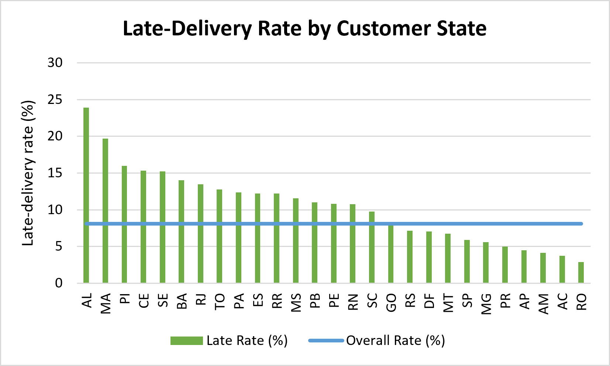
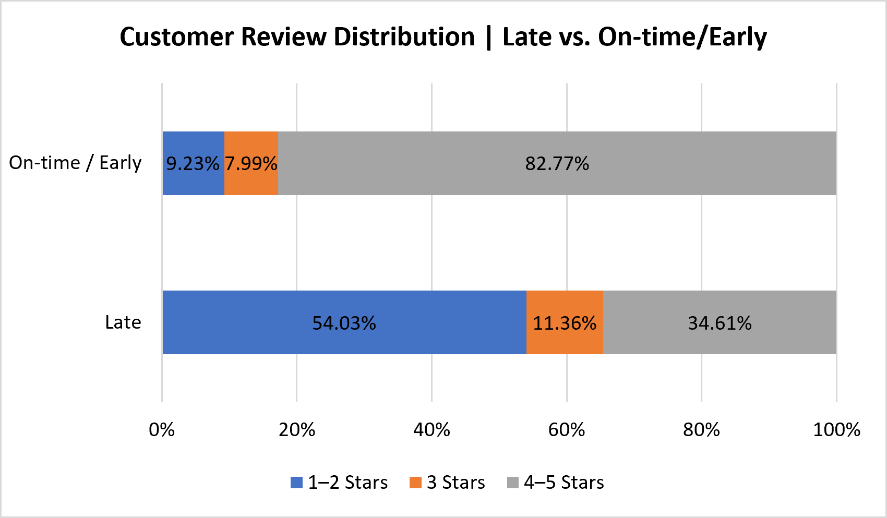
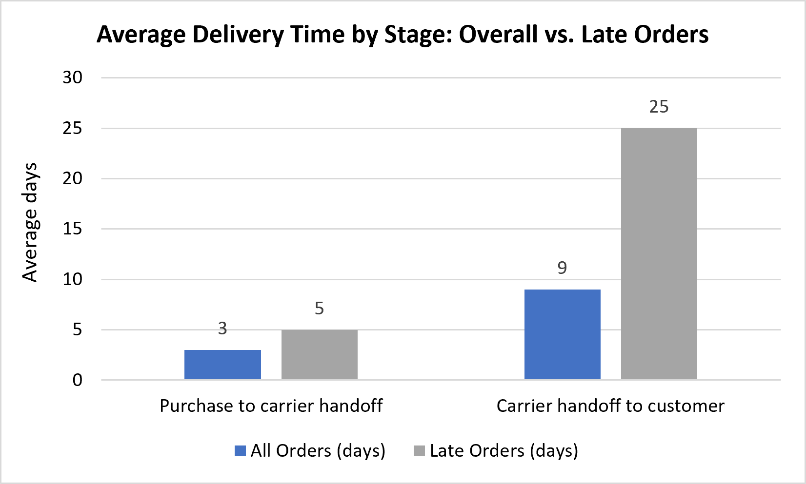

# Olist Marketplace Analysis | SQL Server

An end-to-end SQL analysis of the Olist Brazilian e-commerce dataset (about 99,000 orders, September 2016 to October 2018). The goal: find where delivery is falling short, how it relates to customer reviews, and whether it explains why so few customers come back.

All payment values are in Brazilian reais (R$).

## Key findings

1. **8.11% of delivered orders (7,826) arrived after the estimated date.** Those orders carried R$1.35M, or 8.76% of delivered-order payment value. That is exposure, not lost revenue.
2. **Late orders get much worse reviews.** 54.03% of reviewed late orders got 1–2 stars, against 9.23% for on-time or early orders.
3. **The extra time is spent after carrier handoff.** Late orders averaged 25 days in transit vs. 9 days overall, while purchase-to-carrier handoff time increased from 3 to 5 days.
4. **Late delivery is uneven by state.** Rio de Janeiro (RJ) runs 13.47% late, São Paulo (SP) 5.89%. SP has the most late orders (2,387), largely reflecting its much larger order volume, while its late-delivery rate remains below RJ's.
5. **Retention is very low, and delivery doesn't explain it.** Six-month retention is 2.69%. Customers whose first order was late came back at 2.39%, against 2.72% for on-time first orders. That is a small difference.

## Visualizations

### 1. Late-Delivery Rate by Customer State

### 2. Customer Review Distribution

### 3. Average Delivery Time by Stage

## Business question

Where is the marketplace exposed to poor delivery performance, and how does it relate to customer experience and repeat purchasing?

## Data and tools

- **Data:** [Brazilian E-Commerce Public Dataset by Olist](https://www.kaggle.com/datasets/olistbr/brazilian-ecommerce) on Kaggle, nine tables: `orders`, `order_items`, `customers`, `payments`, `reviews`, `products`, `sellers`, `geolocation`, `category_name_translation`
- **Period:** September 2016 to October 2018, with partial months at both ends
- **Tools:** SQL Server, SSMS
- **SQL used:** CTEs, joins, subqueries, window functions (`ROW_NUMBER`, `LAG`), conditional aggregation, `EXISTS`, date functions, percentiles

## Analysis

### 1. Data checks and baseline

- Eight orders marked as delivered have no customer delivery date, while six canceled orders have one populated. These are low-volume data-quality exceptions that were documented rather than silently ignored.
- 610 products have no category. I left them as they are rather than guess.
- Baseline: 99,441 orders, 96,096 unique customers, 3,095 sellers. Monthly volume is higher in 2018 than 2017, but 2016 and 2018 are partial years, so I didn't call it annual growth.

### 2. Canceled and unavailable orders

I checked for concentration by month, product category and seller. There was no strong pattern. The high rates only showed up in tiny categories and low-volume sellers, which is too little data to draw conclusions from.

### 3. Delivery performance

| Metric | Result |
|---|---:|
| Average delivery time | 12 days |
| Median | 10 days |
| 75th / 90th / 95th percentile | 16 / 23 / 29 days |
| Orders arriving after the estimated date | 7,826 (8.11%) |
| Median delay among late orders | 5 days |
| 75th / 90th / 95th percentile of delay | 11 / 21 / 29 days |

I used the estimated delivery date as the definition of "late" because it is the promise the customer actually saw. The 29-day cutoff is just the 95th percentile, so I treated it as context and not as a finding.

### 4. Customer experience

| | 1–2 stars | 4–5 stars |
|---|---:|---:|
| Late orders | 54.03% | 34.61% |
| On-time or early | 9.23% | 82.77% |

For the slowest 5% of orders (over 29 days), the average review score was 2.2, against 4.2 for everything faster. This is an association, not proof that lateness caused the low ratings.

### 5. Where the delay happens

| Stage | All orders | Late orders |
|---|---:|---:|
| Purchase to carrier handoff | 3 days | 5 days |
| Carrier handoff to customer | 9 days | 25 days |

(Averages are in whole days.) Seller-level slow-delivery rates were only explored, not treated as a finding.

By customer state:

| State | Late orders | Late rate |
|---|---:|---:|
| São Paulo (SP) | 2,387 | 5.89% |
| Rio de Janeiro (RJ) | 1,664 | 13.47% |

Together, SP and RJ account for about 51.8% of all late orders.

### 6. Customer retention

Only 2,997 of 96,096 customers (3.12%) ever ordered twice. That all-time number is biased, because customers who bought in 2018 had little time to return. So I also measured six-month retention. The cohort is customers whose first delivered order was on or before 17 April 2018 (six months before the last order in the data), so everyone had a full window. A customer counts as retained if they placed another delivered order within six months.

| First delivery | Eligible customers | Returned | Six-month retention |
|---|---:|---:|---:|
| Late | 5,943 | 142 | 2.39% |
| On-time or early | 59,974 | 1,631 | 2.72% |
| **All** | **65,917** | **1,773** | **2.69%** |

## Recommendations

1. **Track the late rate against the estimated date as the main delivery KPI.** 8.11% of orders miss it, and those orders get far worse reviews. Report it with median and 90th-percentile delay, not just average delivery time.
2. **Start with the carrier stage.** Late orders spend 25 days after handoff versus 9 days overall, while purchase-to-carrier handoff time increases from 3 to 5 days. Investigate the post-handoff stage first before attributing responsibility to a particular party.
3. **Look at Rio de Janeiro first.** RJ is 13.47% late against 5.89% in SP. Review delivery performance on RJ routes, or test more realistic estimated dates there, then check whether customer reviews improve. SP's high count of late orders largely reflects its much larger order volume.
4. **Treat retention as a separate problem.** Six-month retention is 2.69%, and first-delivery lateness doesn't explain it strongly (2.39% vs. 2.72%). The next step is to test other drivers, such as first-purchase category or order value.

## Limitations

- The data covers a fixed historical period, with partial months at both ends.
- Review-score and delivery comparisons show association, not causation.
- Payment value on late orders is exposure, not lost revenue.
- Stage averages are rounded to whole days.
- Retention results apply to the defined cohort and may not hold for other periods.

## Files

- `SQL OLIST tables schema query.sql`: table schemas and setup queries
- `SQL project OLIST main query.sql`: SQL analysis queries and conclusions

To reproduce the analysis, import the nine Olist tables into SQL Server using the expected table names, then run the main analysis script.

